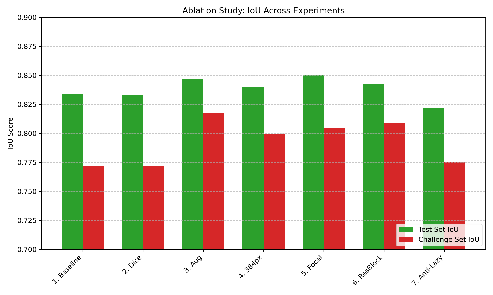
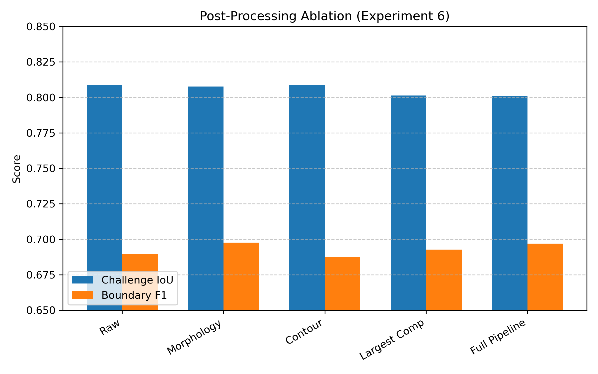
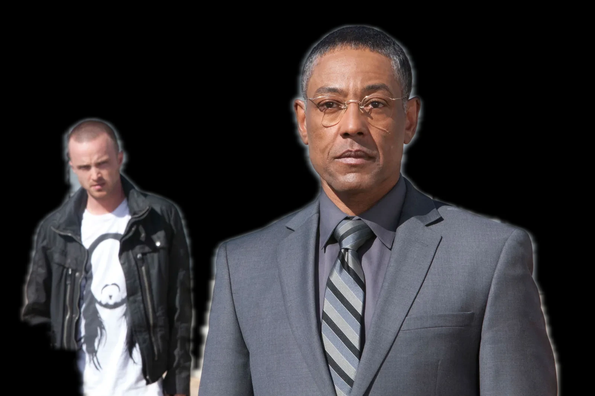
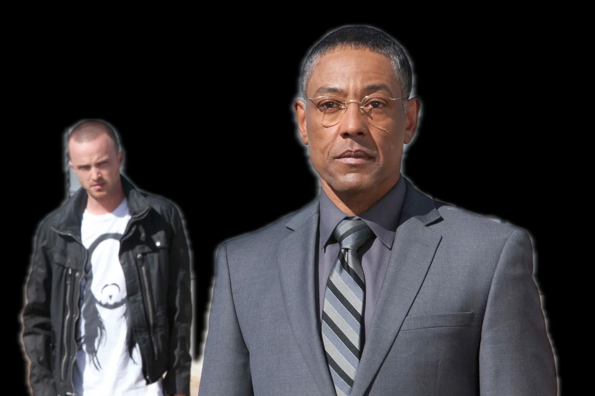

# 🧑‍💻 U-Net Background Remover (Built from Scratch)

[](https://huggingface.co/spaces/moataz115/background-remover)
[](#)
[](#)

A complete end-to-end Machine Learning pipeline for human image segmentation (background removal). Instead of relying on pre-trained backbones (like ResNet) or out-of-the-box APIs, this project features a **fully custom Residual U-Net built mathematically from scratch in PyTorch**, trained on a highly constrained dataset (~2.6k images).

The goal of this project was to demonstrate core Deep Learning fundamentals: custom architecture design, ablation studies, diagnosing dataset bias, hypothesis testing, and engineering a robust production inference pipeline.

### 🚀 Try the Live Web App
**[Click here to try the model live on Hugging Face Spaces!](https://background-remover-ui.vercel.app/)**

---

## 📊 The Ablation Study: An Engineering Journey

Training a model from scratch on just 2,600 images is incredibly difficult. Standard convolutions lose high-frequency details, and standard loss functions ignore fine structures like hair. 

To achieve production-level boundaries, I conducted a strict ablation study, making incremental architectural and mathematical improvements:

| Experiment | Test IoU | Test Dice | Test Bound. F1 | Challenge IoU | Challenge Dice | Challenge Bound. F1 |
| :--- | :--- | :--- | :--- | :--- | :--- | :--- |
| **1. Baseline U-Net (BCE)** | 0.8337 | 0.9001 | 0.7228 | 0.7717 | 0.8581 | 0.6627 |
| **2. + Dice Loss** | 0.8331 | 0.8987 | 0.7273 | 0.7722 | 0.8615 | 0.6440 |
| **3. + Spatial Augmentation** | 0.8469 | 0.9094 | 0.7270 | 0.8178 | 0.8915 | 0.7080 |
| **4. + High Resolution (384px)** | 0.8397 | 0.9036 | 0.6422 | 0.7994 | 0.8803 | 0.5056 |
| **5. + Focal Loss (256px)** | **0.8504** | **0.9118** | **0.7341** | 0.8044 | 0.8835 | 0.6690 |
| **6. + Residual ConvBlocks** | 0.8423 | 0.9065 | 0.7272 | **0.8088** | **0.8845** | **0.6895** |
| **7. The "Anti-Lazy" Model** | 0.8222 | 0.8914 | 0.6801 | 0.7754 | 0.8599 | 0.6328 |



> *(Note on Exp 4: Increasing the image resolution to 384x384 resulted in degraded performance and massive overfitting. It was discarded for subsequent experiments).*
> 
> *(Note on Exp 5: Focal Loss provided the strongest overall performance on the standard test set, particularly improving the Boundary F1 score by penalizing the model for ignoring complex edges).*

### Post-Processing Ablation (Experiment 6)

To bridge the gap between academic metrics and a production-ready user experience, I tested several OpenCV post-processing operations on the final chosen model (Exp 6) against the Challenge Set. 

| Post-Processing Step | Challenge IoU | Challenge Dice | Challenge Bound. F1 |
| :--- | :--- | :--- | :--- |
| **0. Raw Network (No CV2)** | **0.8088** | **0.8845** | 0.6895 |
| **1. Morphology Only** | 0.8076 | 0.8836 | **0.6976** |
| **2. Contour Filling Only** | 0.8087 | 0.8844 | 0.6876 |
| **3. Largest Component Only** | 0.8013 | 0.8784 | 0.6928 |
| **4. Full Production Pipeline** | 0.8008 | 0.8779 | 0.6969 |



> *(Note: The "Largest Component" filter significantly harmed the global IoU because the Challenge Set contained multiple people in the background, which the filter erroneously deleted. However, Morphology and Contour Filling slightly improved the Boundary F1 score by smoothing out jagged edges).*

---

## 📉 The Bias-Variance Tradeoff & The Data Ceiling

During real-world testing of my chosen model (**Experiment 6**), I discovered a critical dataset bias: **Depth-of-Field Overfitting**. Because the training data consisted heavily of professional portraits, the network learned a shortcut: *"If a pixel is blurry, it's background. If it's sharp, it's foreground."* 

**The Hypothesis:** 
I hypothesized that training a new model (**Experiment 7** - The "Anti-Lazy" model) using extreme augmentations (`A.Sharpen`, `A.GaussianBlur`, `A.CoarseDropout`) would destroy the blur shortcut and force the model to learn true human anatomy.

**The Reality (The Data Ceiling):** 
The hypothesis completely failed. Instead of learning true anatomy, the extreme augmentations severely distorted the training data. The model lost its ability to find clean boundaries, resulting in a **massive drop in performance** across both the Standard Test Set and the Challenge Set (Challenge IoU dropped from 0.8088 to 0.7754).

**Conclusion:**
This failure beautifully illustrates the absolute **Data Ceiling** of a from-scratch architecture. When constrained by a microscopic dataset (~2.6k images), you cannot use extreme mathematical augmentations to cure dataset bias. The model simply lacks the prior knowledge (which it would normally get from a massive 100k+ dataset) to understand what a "human" is when heavily distorted by blur or dropout. 

The slightly biased "Specialist" model (Exp 6) yields vastly superior real-world results than the heavily regularized "Generalist" model (Exp 7). Therefore, **Experiment 6 is the final deployed model.**

<!-- Gus & Jesse Real-World Evaluation -->
### Original Image


### Baseline Model (Experiment 1 - Baseline U-Net)


### Final Deployed Model (Experiment 6 - Residual U-Net)


---

## ⚙️ Production Inference Pipeline

Raw Neural Networks rarely output perfect masks. To bridge the gap between academic metrics and a production-ready user experience, I engineered a Microservice Inference Pipeline for deployment:

1. **Test-Time Augmentation (TTA):** The model predicts the image, then predicts a horizontally flipped version of the image, and averages the two probabilities. This acts as a mini-ensemble, smoothing out random hallucinations and sharpening edge certainty.
2. **Dynamic Resolution Guard:** Incoming high-resolution images are intelligently downscaled to a max dimension of 1024px to prevent browser lag and eliminate out-of-memory crashes on free-tier ZeroGPU hardware.
3. **OpenCV Contour Filling & Smoothing:** The raw tensor is passed to OpenCV, which traces the contours of the subject and fills internal masking holes caused by harsh shadows or clothing logos, followed by a Gaussian blur for natural, soft edge boundaries.
4. **High-Res Alpha Channel Cutout:** The inference engine runs the heavy AI on a fast 256×256 payload (matching the model's trained resolution), scales the clean mask up using bilinear interpolation, and packages the result directly into an RGBA PNG with true alpha transparency for instantaneous downloads.

---

## 🛑 Limitations & Future Work

Because this architecture was trained from scratch, it lacks prior contextual knowledge of the world. It will fail on **Severe Occlusions** (e.g., a person holding a large object like a phone or a tool in front of their body). Because the model has never seen these objects, it classifies them as background and cuts holes in the subject.

**Next Steps:** To break the current data ceiling and solve occlusion, the custom Encoder must be replaced with a Transfer Learning approach (e.g., a `ResNet34` backbone pre-trained on ImageNet) to inject prior knowledge of textures and objects into the network.

---

## 📂 Repository Structure

The codebase has been refactored from a Jupyter Notebook into a modular, production-ready structure:

```text
├── model.py       # Custom ResConvBlocks and complete U-Net Architecture
├── dataset.py     # PyTorch Dataset handling dual-image Albumentation pipelines
├── loss.py        # Custom FocalDiceLoss implementation
├── utils.py       # Visulaization functions, and OpenCV post-processing functions
├── train.py       # Training loop, evaluation steps, and checkpoint saving
├── evaluate.py    # Standardized evaluation script for Test and Challenge sets
├── project.ipynb # Clean notebook containing the baseline and residual models
└── app.py         # Gradio Web App for Hugging Face Spaces (ZeroGPU)
```

---

## 🔬 Reproducing the Experiments

All models were trained with a strict `80/10/10` train/val/test split using a global random seed of `42`. To guarantee mathematical reproducibility, all library versions have been locked in `requirements.txt`.

### 1. Training a Model
The training pipeline is fully modular. To reproduce specific experiments from the ablation study, you can pass different model architectures and loss functions directly to the `run_training` function in `train.py`.

```python
import torch.nn as nn
from train import run_training
from model import BackgroundRemoval
from loss import FocalDiceLoss, BCEDiceLoss

# Helper functions to select architectures
def get_baseline_model(): return BackgroundRemoval(use_residual=False)
def get_residual_model(): return BackgroundRemoval(use_residual=True)

# 1. Baseline U-Net (BCE)
run_training(model_class=get_baseline_model, loss_class=nn.BCEWithLogitsLoss)

# 2. + Dice Loss
run_training(model_class=get_baseline_model, loss_class=BCEDiceLoss)

# 3. + Spatial Augmentation (Code handles augmentations in dataset.py)
run_training(model_class=get_baseline_model, loss_class=BCEDiceLoss)

# 4. + High Resolution (384px) (Code handles resize in dataset.py)
run_training(model_class=get_baseline_model, loss_class=BCEDiceLoss)

# 5. + Focal Loss (256px) - The Winning Model
run_training(model_class=get_baseline_model, loss_class=FocalDiceLoss)

# 6. + Residual ConvBlocks
run_training(model_class=get_residual_model, loss_class=FocalDiceLoss)

# 7. The "Anti-Lazy" Model (Code handles heavy augmentations in dataset.py)
run_training(model_class=get_residual_model, loss_class=FocalDiceLoss, epochs=60)
```

### 2. Evaluating a Model
To evaluate a saved model checkpoint on the test set or challenge set, use `evaluate.py`. You can seamlessly toggle the OpenCV post-processing pipeline on or off:

```python
from evaluate import run_evaluation

test_metrics = run_evaluation(
    test_loader=test_loader,
    checkpoint_path="models/best_model.pth",
    threshold=0.4, 
    postprocess=True, # Toggle CV2 morphological cleanup
    output_json="results.json",
    model_class=get_baseline_model # Ensure architecture matches the checkpoint!
)
```

---

## 🛠️ Tech Stack
- **Deep Learning:** PyTorch, Torchvision
- **Computer Vision:** OpenCV (cv2)
- **Data Augmentation:** Albumentations
- **Deployment:** Gradio, Hugging Face Spaces (ZeroGPU Microservice architecture)