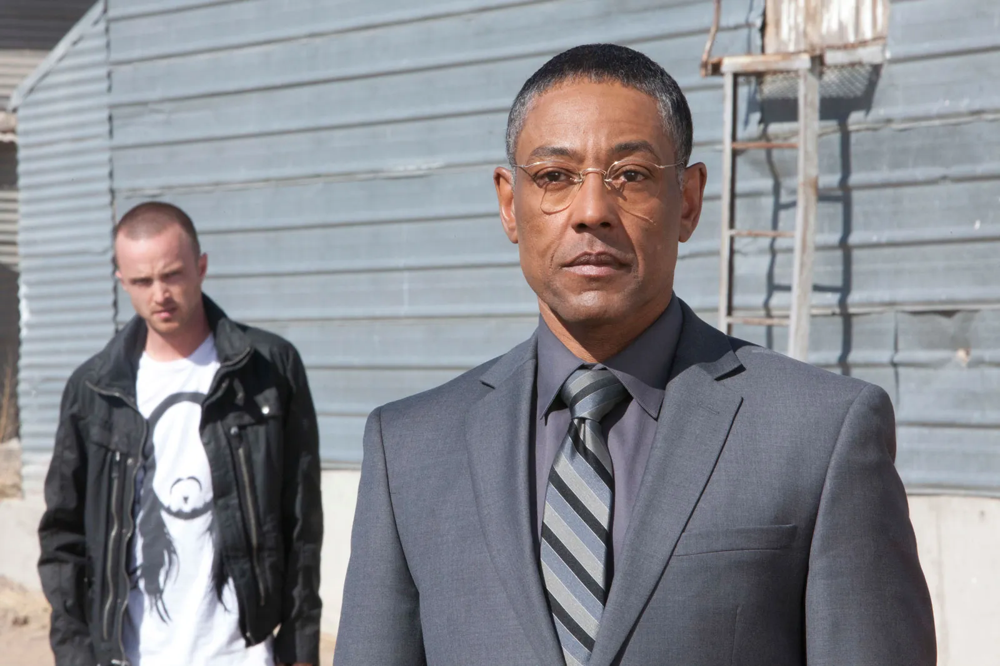
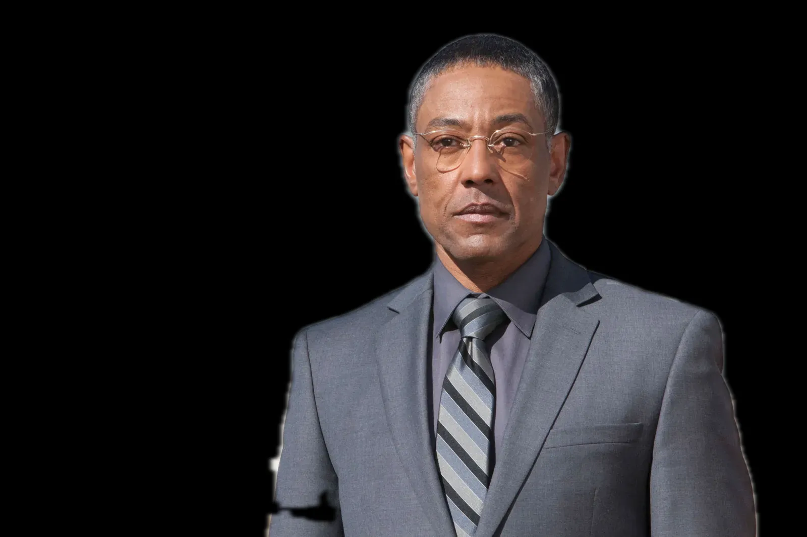

# 🧑‍💻 U-Net Background Remover (Built from Scratch)

[](YOUR_HUGGINGFACE_LINK_HERE)
[](#)
[](#)

A complete end-to-end Machine Learning pipeline for human image matting (background removal). Instead of relying on pre-trained backbones (like ResNet) or out-of-the-box APIs, this project features a **fully custom Residual U-Net built mathematically from scratch in PyTorch**, trained on a highly constrained dataset (~2.6k images).

The goal of this project was to demonstrate core Deep Learning fundamentals: custom architecture design, ablation studies, diagnosing dataset bias, hypothesis testing, and engineering a robust production inference pipeline.

### 🚀 Try the Live Web App
**[Click here to try the model live on Hugging Face Spaces!](https://huggingface.co/spaces/moataz115/background-remover)**

---

## 📊 The Ablation Study: An Engineering Journey

Training a model from scratch on just 2,600 images is incredibly difficult. Standard convolutions lose high-frequency details, and standard loss functions ignore fine structures like hair. 

To achieve production-level boundaries, I conducted a strict ablation study, making incremental architectural and mathematical improvements:

| Experiment | IoU | Dice | Loss Fn | Resolution | Epochs | Optimizer |
| :--- | :--- | :--- | :--- | :--- | :--- | :--- |
| **1. Baseline U-Net** | 0.8129 | 0.8842 | BCE | 256x256 | 25 | Adam |
| **2. + LR Scheduler** | 0.8418 | 0.9058 | BCE + Dice | 256x256 | 40 | Adam + Plateau |
| **3. + Spatial Augmentation** | 0.8527 | 0.9123 | BCE + Dice | 256x256 | 40 | Adam + Plateau |
| **4. + High Resolution Data** | 0.8536 | 0.9131 | BCE + Dice | 384x384 | 50 | Adam + Plateau |
| **5. + Focal Loss** | 0.8535*| 0.9124 | Focal + Dice | 384x384 | 50 | Adam + Plateau |
| **6. + Residual ConvBlocks** | **0.8639** | **0.9210** | Focal + Dice | 384x384 | 50 | Adam + Plateau |
| **7. + AdamW (Weight Decay)**| 0.8653** | 0.9205 | Focal + Dice | 384x384 | 50 | AdamW + Plateau |
| **8. The "Anti-Lazy" Model** | *0.8487* | *0.9100* | Focal + Dice | 384x384 | 60 | Adam + Plateau |

> *(Note on Exp 5: While overall IoU stayed flat, Focal Loss massively improved visual fidelity on tiny, hard-to-predict objects like fingers and watches by penalizing the model for ignoring complex boundaries).*
> 
> *(Note on Exp 7: Despite Experiment 7 having a mathematically higher IoU, visual inspection revealed that AdamW restricted the model too much, causing a loss of sharp edge details. I chose to reject the metric bump and move forward with Experiment 6 as the base).*

---

## 📉 The Bias-Variance Tradeoff & The Data Ceiling

During real-world testing of my chosen model (**Experiment 6**), I discovered a critical dataset bias: **Depth-of-Field Overfitting**. Because the training data consisted heavily of professional portraits, the network learned a shortcut: *"If a pixel is blurry, it's background. If it's sharp, it's foreground."* 

**The Hypothesis:** 
I trained **Experiment 8** (The "Anti-Lazy" model) using extreme augmentations (`A.Sharpen`, `A.GaussianBlur`, `A.CoarseDropout`) to destroy the blur shortcut and force the model to learn true human anatomy.

**The Reality (The Breaking Bad Test):** 
I tested both models on a complex image featuring depth-of-field (a blurry subject in the background) and low-contrast boundaries (a dark suit blending into a shadow). The results perfectly illustrated the Bias-Variance tradeoff:

1. **The Blur Bias:** The Baseline model (Exp 6) completely erased the second person (Jesse) because he was slightly out of focus. It relied on its "blur = background" shortcut.
2. **The Hypothesis Succeeded:** The heavily augmented model (Exp 8) successfully segmented the second person. The augmentations successfully destroyed the depth-of-field bias, forcing the model to recognize the human shape regardless of blur.
3. **The Data Ceiling:** However, BOTH models failed to segment the edge of the primary subject's arm (Gus) where the dark suit blended into a dark shadow. 

**Conclusion:**
While extreme augmentation successfully cured the model's biases, it revealed the absolute **Data Ceiling** of a from-scratch architecture. Without a massive dataset (e.g., 100k+ images), the model cannot learn the robust anatomical priors required to guess boundaries when pixel contrast drops to zero. 

When constrained by a microscopic dataset (~2.6k images), the slightly biased "Specialist" model (Exp 6) yields cleaner real-world results on standard portraits than the heavily regularized "Generalist" model (Exp 8). **Experiment 6 is the final deployed model**, but Experiment 8 proved that mathematical augmentations can successfully manipulate network behavior.

<!-- Put your Gus & Jesse image right here! -->
### Original Image

### Baseline Model (Blur Bias)

### Anti-Lazy Model (Augmented)


---

## ⚙️ Production Inference Pipeline

Raw Neural Networks rarely output perfect masks. To bridge the gap between academic metrics and a production-ready user experience, I engineered a Microservice Inference Pipeline for deployment:

1. **Test-Time Augmentation (TTA):** The model predicts the image, then predicts a horizontally flipped version of the image, and averages the two probabilities. This acts as a mini-ensemble, smoothing out random hallucinations.
2. **Model Ensembling:** The Gradio app allows users to run an ensemble of both the "Specialist" (Exp 6) and "Generalist" (Exp 8) models, averaging their probabilities for a highly robust final prediction.
3. **OpenCV Contour Filling:** The raw tensor is passed to OpenCV, which traces the outermost `RETR_EXTERNAL` contour of the person and fills it with solid white. This permanently patches internal masking holes caused by harsh shadows or clothing logos.
4. **High-Res Alpha Blending:** The inference engine runs the heavy AI on a tiny `384x384` payload, then mathematically scales the generated mask back up to the original resolution (e.g., 4K) using `cv2.INTER_LINEAR` and applies a Gaussian Blur for professional soft-edge alpha compositing.

---

## 🛑 Limitations & Future Work

Because this architecture was trained from scratch, it lacks prior contextual knowledge of the world. It will fail on **Severe Occlusions** (e.g., a person holding a large object like a phone or a tool in front of their body). Because the model has never seen these objects, it classifies them as background and cuts holes in the subject.

**Next Steps:** To break the current data ceiling and solve occlusion, the custom Encoder must be replaced with a Transfer Learning approach (e.g., a `ResNet34` backbone pre-trained on ImageNet) to inject prior knowledge of textures and objects into the network.

---

## 📂 Repository Structure

The codebase has been refactored from a Jupyter Notebook into a modular, production-ready structure:

```text
├── model.py       # Custom ResConvBlocks and complete U-Net Architecture
├── dataset.py     # PyTorch Dataset handling dual-image Albumentation pipelines
├── loss.py        # Custom FocalDiceLoss implementation
├── utils.py       # Visulaization functions, and OpenCV post-processing functions
├── train.py       # Training loop, evaluation steps, and checkpoint saving
├── demo.ipynb     # Visualizations, baseline comparisons, and inference examples
└── app.py         # Gradio Web App for Hugging Face Spaces (ZeroGPU)
```

---

## 🛠️ Tech Stack
- **Deep Learning:** PyTorch, Torchvision
- **Computer Vision:** OpenCV (cv2)
- **Data Augmentation:** Albumentations
- **Deployment:** Gradio, Hugging Face Spaces (ZeroGPU Microservice architecture)